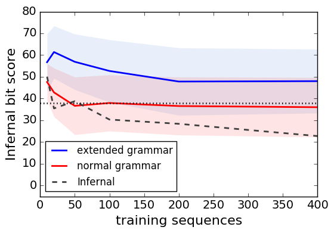
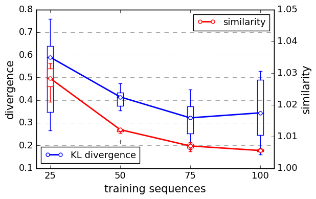

# Graphlearn with long range dependencies

We adapt a graph grammar to incorporate long range dependencies.
This is acchieved by coarsening a graph and combining 
the interface on the base and coarsened level. 


## Experimental results

We test out grammar on RNA molecules. 
Generated graphs are assigned a bit-score by a state of the art oracle.
Human expers have determines that an instance with a bitscore of higher
than 39 should be considered to belong to the RNA family in question. 





## Usage General Case

This should take care of all dependencies.
```
pip3 install git+https://github.com/fabriziocosta/EDeN.git --user
pip3 install graphlearn structout
```

Lets first load some data, input musst be networkx graphs with 'label' annotation on every node/edge.
The cycler will generate a coarsened graph that contracts cycles 
and store the original graph in g.graphp['original'].

```python3
from graphlearn3.util import util as util_top
from graphlearn3.test import cycler
g = util_top.test_get_circular_graph()
gplus=g.copy()
gplus.node[0]['label']='weird' 
c=cycler.Cycler()
g=c.encode_single(g)
gplus = c.encode_single(gplus)
```


Fitting a grammar and conducting one substitution
```python3
from graphlearn3.lsgg_layered import lsgg_layered
decomposition_args={ "base_thickness_list":[2],
                    "radius_list": [0],
                    "thickness_list": [1]}
lsggg = lsgg_layered(decomposition_args=decomposition_args)
lsggg.fit([g, gplus, g,gplus])
neigh = lsggg.neighbors(gplus).__next__()
```

Print original and generated graph to terminal
```python3
import structout as so
so.gprint([gplus, gplus.graph['original']], size =15)
neigh=c.encode_single(neigh)
so.gprint([neigh, neigh.graph['original']], size =15)
```

## Usage RNA

The code below demonstrates how to use this technique on RNAs, 
if you are interested in the application on general graphs please see the
modern implementation showcased above.


```python
import graphlearn.abstract_graphs.RNA as rna
from graphlearn.estimator import Wrapper as estimatorwrapper

sampler=rna.AbstractSampler(radius_list=[0,1], 
                            thickness_list=[2],  
                            min_cip_count=1, 
                            min_interface_count=2, 
                            preprocessor=rna.PreProcessor(base_thickness_list=[1],ignore_inserts=True),
                            postprocessor=rna.PostProcessor(),
                            estimator=estimatorwrapper( nu=.5, cv=2, n_jobs=-1)
                           )
sequences = sampler.sample([sequences from an RNA family])

```


## Graph grammar 

A modern version of the grammar can be found at 
https://github.com/fabriziocosta/GraphLearn


## Running the experiments

Experiments are in code/experiments.
HPC scripts are for the "sun grid engine".

## comparison to GraphRNN

In the paper we demonstrated GraphRNN applied to RNA grpahs. Our modified GraphRNN:

https://github.com/smautner/GraphRNN

